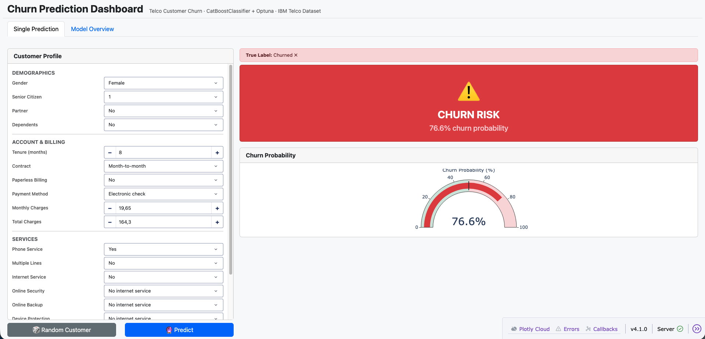
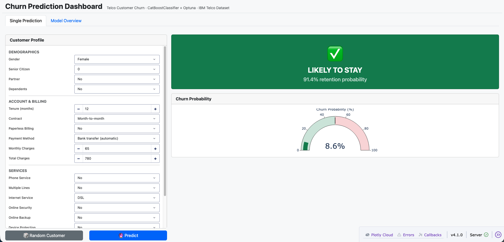
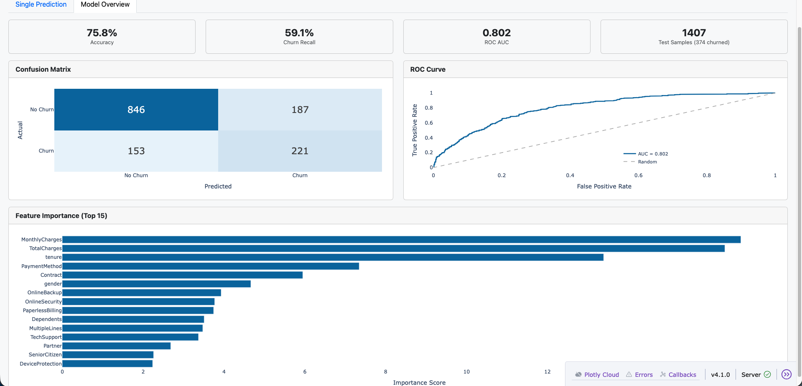

# Churn Prediction — End-to-End ML System

A production-ready machine learning pipeline for predicting customer churn using the [IBM Telco Customer Churn dataset](https://www.kaggle.com/datasets/blastchar/telco-customer-churn). The system is structured as a modular Python project following ML engineering best practices: config-driven, pipeline-based, and fully reproducible.

---

## Problem Statement

Customer churn is a critical business metric in the telecom industry. This project builds a binary classifier to predict whether a customer will churn (`Yes`/`No`) based on their account details, services subscribed, and billing information.

**Target variable:** `Churn` (1 = churned, 0 = retained)

---

## Results

| Metric | Score |
|---|---|
| Accuracy | 0.758 |
| Weighted F1 | 0.762 |
| Macro F1 | 0.699 |

Model: **CatBoostClassifier** tuned with **Optuna** (50 trials, 5-fold StratifiedKFold CV)

---

## Project Structure

```
churn_prediction/
├── config/
│   └── config.yaml                  # All pipeline parameters
├── data/
│   └── WA_Fn-UseC_-Telco-Customer-Churn.csv
├── models/
│   └── prod/
│       └── latest_model.cbm         # Trained CatBoost model (generated after training)
├── app-ml/
│   ├── src/
│   │   └── pipelines/
│   │       ├── preprocessing.py     # Data cleaning & target encoding
│   │       ├── feature_engineering.py  # Categorical label encoding
│   │       ├── training.py          # Optuna hyperparameter tuning + CatBoost
│   │       ├── inference.py         # Model loading & prediction
│   │       ├── postprocessing.py    # Evaluation & model saving
│   │       └── pipeline_runner.py   # Orchestrates all pipeline stages
│   └── entrypoint/
│       ├── train.py                 # Training entrypoint
│       └── inference.py             # Inference entrypoint
└── common/
    ├── data_manager.py              # Data I/O, train/test split, upsampling
    └── utils.py                     # Config reader, model save/load, plotting
```

---

## Pipeline Overview

```
Raw CSV
   │
   ▼
[Preprocessing]
  - Fix TotalCharges (empty string → NaN → float)
  - Drop customers with tenure == 0
  - Drop customerID column
  - Encode target: Yes → 1, No → 0
   │
   ▼
[Feature Engineering]
  - LabelEncoder on all categorical (object) columns
  - Tree-based models handle label-encoded features well; avoids one-hot sparsity
   │
   ▼
[Train/Test Split]
  - Stratified split (80/20) to preserve class balance
  - Optional minority-class upsampling on training set
   │
   ▼
[Training]
  - Optuna study (50 trials, TPE sampler)
  - 5-fold StratifiedKFold CV per trial, maximising macro F1
  - Final model trained on full training set with best hyperparameters
   │
   ▼
[Inference]
  - Load saved .cbm model
  - Predict on held-out test set
   │
   ▼
[Postprocessing]
  - Classification report (precision, recall, F1 per class)
  - Confusion matrix plot saved to inference_results.png
```

---

## Demo UI

An interactive Dash app for demoing the system — input any customer profile and get an instant churn prediction with probability.

### Churn Risk Prediction


### Safe Prediction (Likely to Stay)


### Model Overview


### Launch the app

```bash
pip install -r app-ui/requirements.txt
python app-ui/app.py
```

Open `http://localhost:8050` in your browser.

| Feature | Description |
|---|---|
| 🎲 Random Customer | Load a real customer from the test set with their true churn label |
| 🔮 Predict | Run inference and display churn probability + color-coded result |
| Model Overview tab | Confusion matrix, ROC curve, feature importance |

---

## Quickstart

### Option A — Docker (recommended)

Requires [Docker Desktop](https://www.docker.com/products/docker-desktop/).

```bash
git clone https://github.com/jeannineshiu/churn_prediction.git
cd churn_prediction

docker-compose up --build
```

Then open `http://localhost:8050` in your browser.

**What happens under the hood:**

```
docker-compose up --build
        │
        ├── app-ml-train  →  trains model, saves to ./models/ (then exits)
        │
        └── app-ui        →  waits for model, then serves Dash app on :8050
```

Other useful commands:

```bash
# Train only (no UI)
docker-compose run app-ml-train

# Start UI only (model already trained)
docker-compose up app-ui

# Stop everything
docker-compose down
```

---

### Option B — Local (conda)

### 1. Clone the repository

```bash
git clone https://github.com/jeannineshiu/churn_prediction.git
cd churn_prediction
```

### 2. Create and activate the conda environment

```bash
conda create -n churn-prediction python=3.10 -y
conda activate churn-prediction
```

### 3. Install dependencies

```bash
pip install -r requirements.txt
pip install -r app-ui/requirements.txt
```

### 4. Train the model

```bash
python app-ml/entrypoint/train.py
```

This will:
- Run Optuna hyperparameter search (50 trials)
- Train the final model on the full training set
- Save the model to `models/prod/latest_model.cbm`

### 5. Run inference (optional)

```bash
python app-ml/entrypoint/inference.py
```

Prints the classification report and saves a confusion matrix to `inference_results.png`.

### 6. Launch the UI

```bash
python app-ui/app.py
```

Open `http://localhost:8050` in your browser.

---

## Configuration

All pipeline behaviour is controlled via [`config/config.yaml`](config/config.yaml). Key parameters:

```yaml
pipeline_runner:
  test_size: 0.20        # Fraction held out for evaluation
  upsample: true         # Minority-class upsampling on training set

training:
  iterations: 1000
  early_stopping_rounds: 100
  n_cv_splits: 5

  optuna:
    n_trials: 50         # Increase for better tuning at the cost of time
    search_space:
      learning_rate: [0.01, 0.2]
      depth: [3, 8]
      l2_leaf_reg: [0.5, 5.0]
```

---

## Dataset

**IBM Telco Customer Churn** — 7,043 customers, 20 features + 1 target.

Key feature groups:
- **Demographics**: gender, SeniorCitizen, Partner, Dependents
- **Account**: tenure, Contract, PaperlessBilling, PaymentMethod
- **Services**: PhoneService, InternetService, OnlineSecurity, TechSupport, etc.
- **Billing**: MonthlyCharges, TotalCharges

**Class distribution**: ~73% No Churn / ~27% Churn → imbalanced; addressed via stratified splitting and upsampling.

---

## Key Design Decisions

- **LabelEncoder over One-Hot Encoding** — tree-based models (CatBoost, Random Forest) handle ordinal-encoded categoricals natively; one-hot encoding would add ~30 sparse columns with no benefit.
- **Upsampling over class weights** — minority upsampling on the training set improves recall for the churn class without requiring model-level adjustments.
- **StratifiedKFold in Optuna** — preserves class distribution in each fold, giving a reliable F1 estimate on an imbalanced dataset.
- **Config-driven** — all hyperparameter ranges, paths, and split ratios live in `config.yaml` so experiments are reproducible without touching source code.
